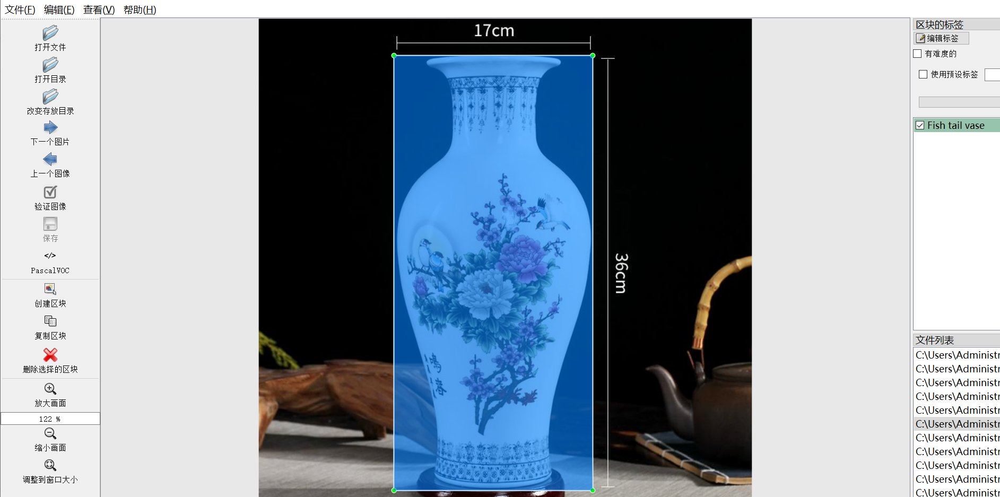
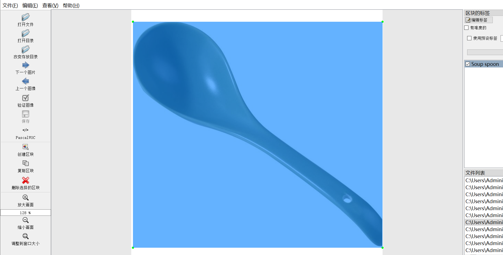
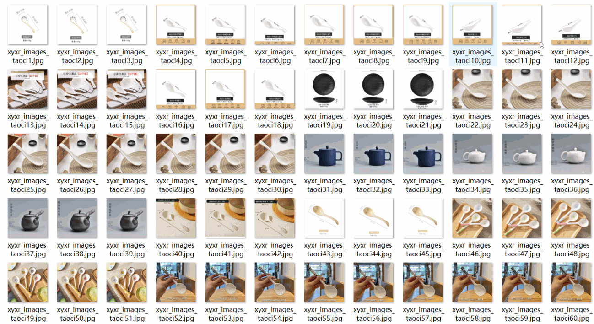
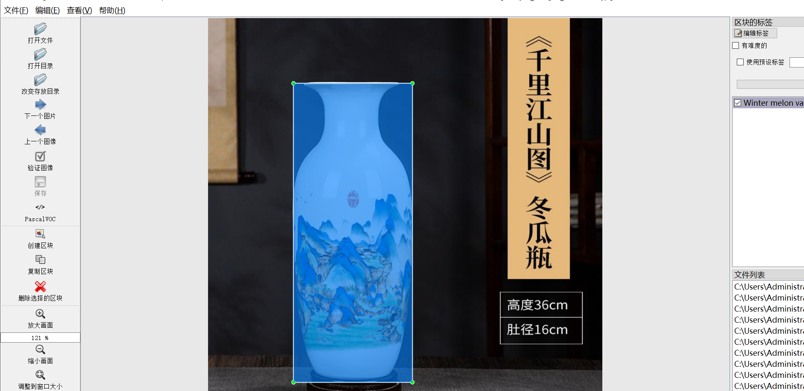

# [Object Detection] Ceramic Products Recognition Dataset
4485 images, 13 types
Products YOLO+VOC (Augmented)

Dataset format: VOC format + YOLO format

The dataset is packaged in three folders, each storing images, xml, and txt files.

In the JPEGImages folder, there are a total of 4485 jpg images.

In the Annotations folder, there are a total of 4485 xml files.

In the labels folder, there are a total of 4485 txt files.

Number of labels: 13

Label names: ["Bowl", "Decorative vase", "Fish tail vase", "Plate", "Plum vase", "Pomegranate vase", "Soup spoon", "Spring vase", "Tea wash", "Teacup", "Teapot", "Water glass", "Winter melon vase"]

The number of bounding boxes for each label (note that the order of categories in the YOLO format does not correspond to this, but is based on the classes.txt file in the labels folder):

Bowl Bounding Boxes = 587 (bowl)

Decorative vase Bounding Boxes = 303 (decorative vase)

Fish tail vase Bounding Boxes = 384 (fish tail vase)

Plate Bounding Boxes = 1461 (piece)

Plum vase Bounding Boxes = 300 (Plum vase)

Pomegranate vase Bounding Boxes = 303 (pomegranate vase)

Soup spoon Bounding Boxes = 891 (soup spoon)

Spring vase Bounding Boxes = 300 (spring vase)

Tea wash Bounding Boxes = 306 (tea wash)

Teacup Bounding Boxes = 303 (teacup)

Teapot Bounding Boxes = 300 (teapot)

Water glass Bounding Boxes = 336 (water glass)

Winter melon vase Bounding Boxes = 300 (winter melon vase)

Total bounding boxes: 6074

Image clarity (resolution: pixels): Clear

Images have been enhanced: Yes

Label shape: Rectangular boxes, used for target detection recognition

Important Note: No guarantees are made regarding the accuracy or weight files of the trained models using this dataset. The dataset provides accurate and reasonable annotations only.

Annotation Example:

## Images

---

Here is a pay link on Stripe (https://buy.stripe.com/3cs8yP7sY87d0vu9AB). Please contact me lonlonago@foxmail.com after funding $89, and I will send you a complete data files, thank you!

